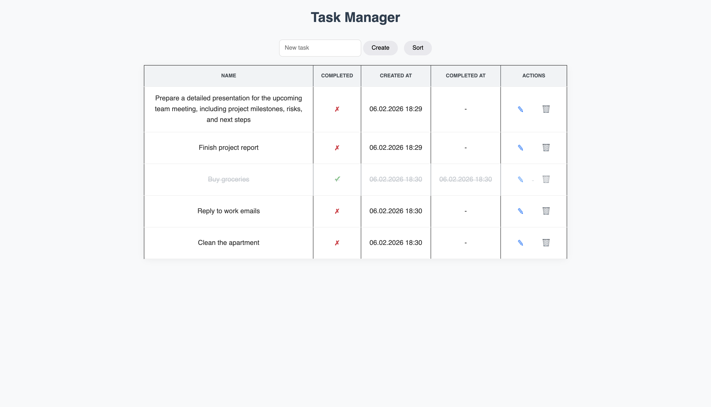
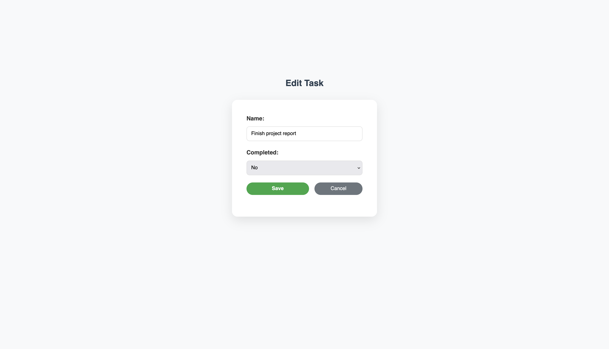

# 📝 TODO App (Go)

A web-based TODO application written in Go that helps manage tasks and recommends their priority using AI-powered sorting.  
Tasks are stored in a SQLite database, and the application provides a simple HTML/CSS frontend rendered on the server.  
The project focuses on backend development, clean code structure, and practical integration of an external LLM API.

---

## 📚 Contents

- [📝 TODO App (Go)](#-todo-app-go)
  - [📚 Contents](#-contents)
  - [✨ Features](#-features)
  - [📸 Screenshots](#-screenshots)
    - [Tasks Page](#tasks-page)
    - [Edit Task Page](#edit-task-page)
  - [🤖 AI-Powered Task Sorting](#-ai-powered-task-sorting)
- [🧱 Tech Stack](#-tech-stack)
    - [Backend](#backend)
    - [AI](#ai)
    - [Frontend](#frontend)
- [📂 Project Structure](#-project-structure)
    - [🗄 Database](#-database)
    - [⚙️ Configuration](#️-configuration)
- [🚀 How to Run](#-how-to-run)
    - [Prerequisites](#prerequisites)
    - [🔑 Groq API Key](#-groq-api-key)
    - [Installation](#installation)

---

## ✨ Features

- Create, edit, complete, and view tasks
- SQLite database with proper constraints
- HTML templates using Go templates
- Clean separation of concerns (handlers / services / storage)
- **AI-based task sorting** using an LLM
- Robust error handling and logging
- Simple, clean UI with custom CSS

---

## 📸 Screenshots


### Tasks Page


### Edit Task Page


---

## 🤖 AI-Powered Task Sorting

Click the **Sort** button to let the AI organize your tasks by priority.  

**How it works:**
1. 📨 Tasks are sent to the AI (Groq API) with their ID, name, and completion status.  
2. 🧠 The AI evaluates priority and urgency for each task.  
3. 🔄 The backend updates the task list according to the AI’s suggested order.  

> The AI only **recommends the order** — all task data remains under backend control.

---

# 🧱 Tech Stack

### Backend


### AI


### Frontend


---

# 📂 Project Structure

```
todo-server/
├── cmd/
│   └── main.go
├── config/
│   └── local.yaml
├── internal/
│   ├── ai/
│   │   └── sort.go
│   ├── config/
│   │   └── config.go
│   ├── handlers/
│   │   ├── aiSortTasks.go
│   │   ├── allTasks.go
│   │   ├── createTask.go
│   │   ├── deleteTask.go
│   │   ├── getTask.go
│   │   ├── handler.go
│   │   └── updateTask.go
│   ├── logger/
│   │   └── logger.go
│   ├── storage/
│   │   ├── sqlite/
│   │   │   └── sqlite.go
│   │   └── storage.db
│   ├── task/
│   │   └── task.go
│   └── templates/
│       ├── base.html
│       ├── edit.html
│       └── tasks.html
├── static/
│   └── css/
│       ├── base.css
│       ├── edit.css
│       └── tasks.css
├── screenshots/
│   ├── tasks.png
│   └── edit.png
├── .env
├── .env.example
├── .gitignore
├── docker-compose.yml
├── Dockerfile
├── go.mod
├── go.sum
├── Makefile
└── README.md
```

---

### 🗄 Database

SQLite database with a `Tasks` table:

| Column       | Type     | Description                  |
| ------------ | -------- | ---------------------------- |
| ID           | INTEGER  | Primary key (AUTOINCREMENT)  |
| Name         | TEXT     | Task name (UNIQUE, NOT NULL) |
| Completed    | INTEGER  | Completion status (0/1)      |
| Created_at   | DATETIME | Creation timestamp           |
| Completed_at | DATETIME | Completion timestamp         |


---

### ⚙️ Configuration

Set your Groq API key as an environment variable:

```bash
export GROQ_API_KEY=your_api_key_here
```

---

# 🚀 How to Run

### Prerequisites

Make sure you have the following installed:

- **Go** (version 1.21+ recommended)
- **SQLite3** (for database)
- **Make** (optional, if you want to use `make` commands)
- Environment variable for Groq API key

### 🔑 Groq API Key

This project uses the **Groq API** for AI-powered task sorting. You need an API key to enable AI functionality.

1. Sign up or log in at [Groq API](https://www.groq.com/).  
2. Go to **API Keys** in your account dashboard.  
3. Create a new API key (or copy an existing one).  
4. Set the API key as an environment variable:

```bash
export GROQ_API_KEY=your_api_key_here
```

On Windows (PowerShell):

```bash
setx GROQ_API_KEY "your_api_key_here"
```

---

### Installation

1. **Clone the repository:**

```bash
git clone https://github.com/onaq21/todo-server
cd todo-server
```

2. **Install Go dependencies:**

```bash
go mod tidy
```

3. **Run the application:**

You have several options:

* Using Go directly:

```bash
go run cmd/main.go
```

* Using Make (if Makefile is present):

Before running, make sure to **create a `.env` file** in the project root and add your Groq API key:

```bash
GROQ_API_KEY=<your_groq_api_key>
```
Then, run the application using **Make**:
```bash
make service-run
```

* Using Docker:

```bash
make docker-up     # Start the Docker container
make docker-down   # Stop the Docker container
```

4. **Access the web interface:**

Open your browser and go to:

```
http://localhost:5051
```